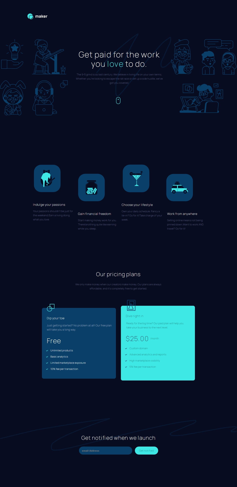

# Maker Pre-Launch Landing Page

## Table of contents

- [Overview](#overview)
  - [The challenge](#the-challenge)
  - [Screenshot](#screenshot)
  - [Links](#links)
- [My process](#my-process)
  - [Built with](#built-with)
  - [What I learned](#what-i-learned)
  - [Continued development](#continued-development)
- [Author](#author)

## Overview

### The challenge

Users should be able to:

- View the optimal layout depending on their device's screen size
- See hover states for interactive elements
- Receive an error message when the form is submitted if:
  - The `Email address` field is empty should show "Oops! Please add your email"
  - The email is not formatted correctly should show "Oops! That doesn’t look like an email address"

### Screenshot



**Note: Web capture removes some font and styling effects, so check out the website!**

### Links

- Live Site URL: [Maker Pre Launch](https://maker-prelaunch.netlify.app)

## My process

### Built with

- Semantic HTML5 markup
- Sass/SCSS
- Flexbox
- JavaScript
- Mobile-first workflow

### What I learned

For this webpage I decided to use a Mobile-first workflow. This project featured unique layout shifts for each screen size. As I moved from mobile to tablet, to desktop, it was important to continually group select components together. On the mobile design. It was not readily apparent how to group the pages, and I had to account for that in this build.

I had a change to improve the way I use email validation shown below:

```javascript
function validateEmail(email) {
  let regEx = /\S+@\S+\.\S+/;
  return regEx.test(email);
}

function validate() {
  const $result = $("#result");
  const email = $("#email").val();
  const $email = $("#email");
  $result.text("");

  if (validateEmail(email)) {
    $email.addClass("border--success");
    $email.removeClass("border--error");
  } else if (email === "") {
    $result.text("Oops! Please add your email");
    $email.addClass("border--error");
    $email.removeClass("border--success");
  } else {
    $result.text("Oops! That doesn't look like an email");
    $email.addClass("border--error");
    $email.removeClass("border--success");
  }
  return false;
}
```

This uses a jQuery approach to inform users if there email is valid or invalid. The input textbox will be lined with either red (and display an error message), or green if there depending on their input.

I also took into account using ` <br>` at select points. Typically I would try to use margins to get the look of the paragraph I wanted, but it would shift depending on the viewport. I found at some points it is easier to use break to better handle layout shifts.

### Continued development

Typically I did not use multiple branches when developing code alone. This help me to establish more useful commits to the main branch. Group work I always saw a need for it, but It can help me organize my personal code and prevent deployment mistakes when using sites like Netlify.

## Author

- Website - [Jason Nembhard](https://www.jasonnembhard.com)
- Frontend Mentor - [@jNembhard](https://www.frontendmentor.io/profile/jNembhard)
